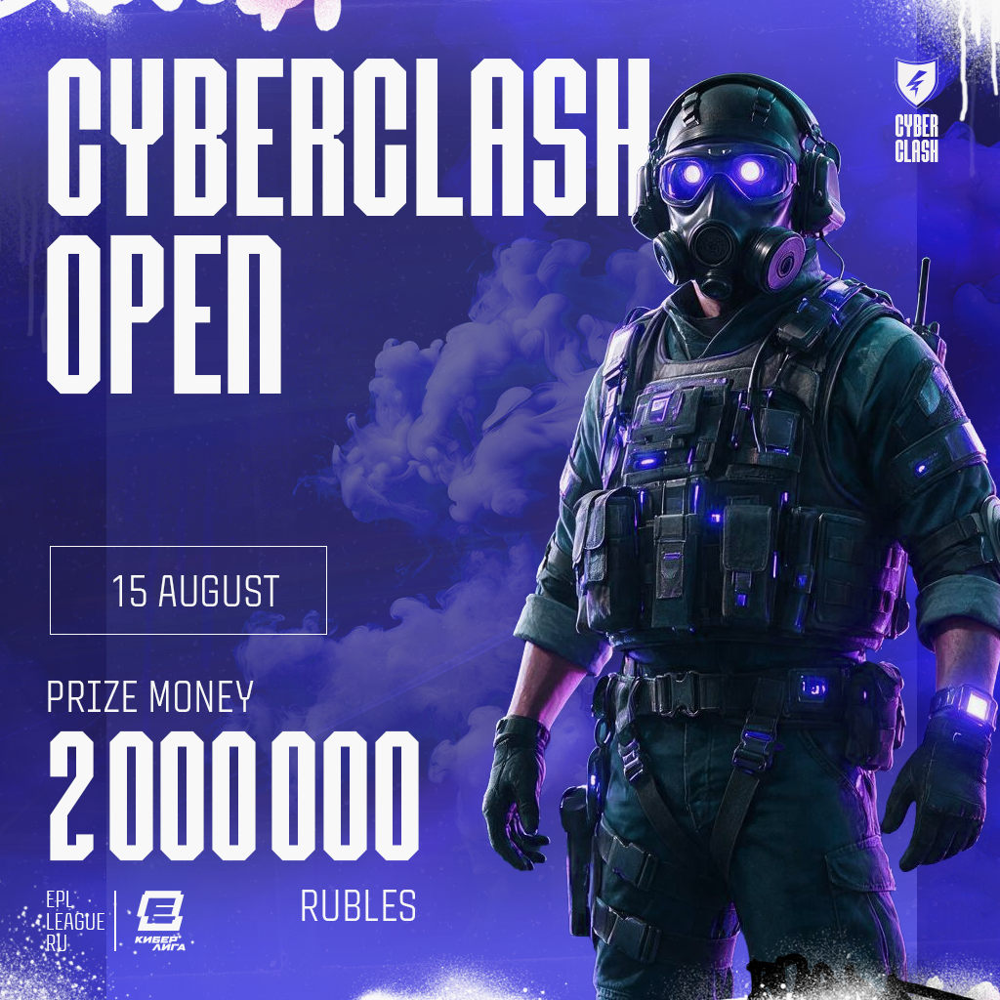

# CyberClash Open announcement and additional info

  

# Tournament info

- **Tournament VRS Tier** - VRS Tier 2 

- **VRS publication date used for seeding:** August 2026

- An official application will be submitted to HLTV.org for VRS inclusion. Please note that HLTV.org makes the final decision on which matches count towards the ranking.

# Tournament Format
Tournament contains following stages:

- Open Qualifiers Stage - (Online - Single Elimination BO1/BO3 for Semi-Final Matches - 15th of August - 23rd of August 2026)
- Main Event Group Stage - Best 8 teams from Open Qualifiers (Online - 26 - 28th of August 2026 - 2 GSL BO3 Groups. Best 2 teams from each group advance to the play-off stage)
- Main Event Play-off Stage - Best 4 teams from Main Event Group Stage (Online - 29th of August 2026 - 30th of August - Single Elimination BO3 with 3rd place decider).

# Open Qualifiers

*Who can participate?*

*Any teams/mix of players with representatives from CIS (Russia, Belarus, Kazakhstan, Armenia, Azerbaijan, Tajikistan, Turkmenistan, Kyrgyzstan, Uzbekistan, and Georgia) and any teams/mix of players with representatives from European Union*

**Open Qualifier №1 - 2 teams advance to the main stage - 15th of August 2026**
- Registration will open 8th of August 14:00 CET

[Registration link](https://www.faceit.com/ru/championship/8530f9ce-f860-49ce-810c-702098bd1d8e/CyberClash%20Open%20%7C%20Qualifier%201)

**Open Qualifier №2 - 2 teams advance to the main stage - 28th of February 2026**
- Registration will open 8th of August 14:00 CET

[Registration link](https://www.faceit.com/ru/championship/d38b9237-5322-4992-be56-867003c4b7ca/CyberClash%20Open%20%7C%20Qualifier%202)

**Open Qualifier №3 - 2 teams advance to the main stage - 1st of March 2026**
- Registration will open 8th of August 14:00 CET

[Registration link](https://www.faceit.com/ru/championship/732947dc-2d91-4856-9ef7-5a852dbadc46/CyberClash%20Open%20%7C%20Qualifier%203)

**Open Qualifier №4 - 2 teams advance to the main stage - 2nd of March 2026** 
- Registration will open 8th of August 14:00 CET

[Registration link](https://www.faceit.com/ru/championship/9647d5cc-fdf1-4881-836c-41d765988090/CyberClash%20Open%20%7C%20Qualifier%204)

# Prize Pool

Total Prize Pool of **Main event** is 2.000.000 RUB *(two million rubles)* - **25 495 USD**

| Place | Prize |
| --- | --- |
| 1st place | 12 747 USD |
| 2nd place | 6 373 USD |
| 3rd place | 3 824 USD |
| 4th place | 2 549 USD |

# Open Qualifiers Rules

[Open Qualifiers Rules](open-quals-rules.md)

# Visa/Location

**Location**: Europe (Online)

# Main Event Rulebook

*Main event rulebook will be shared with teams no later than 25th of August 2026.*

# Disqualification and Technical Defeat Policy 

[Disqualification and Technical Defeat Policy](disqualification-and-technical-defeat-policy.md)

# Verifiability
- This Additional Information is published on a platform that preserves version history
